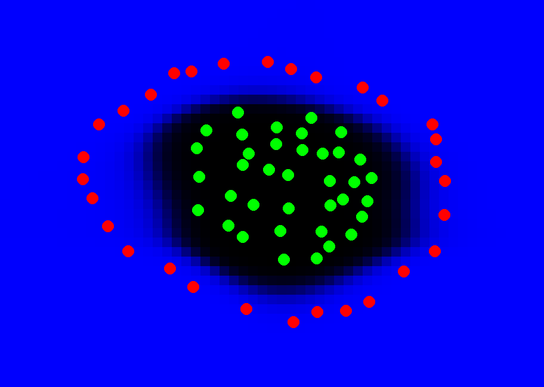
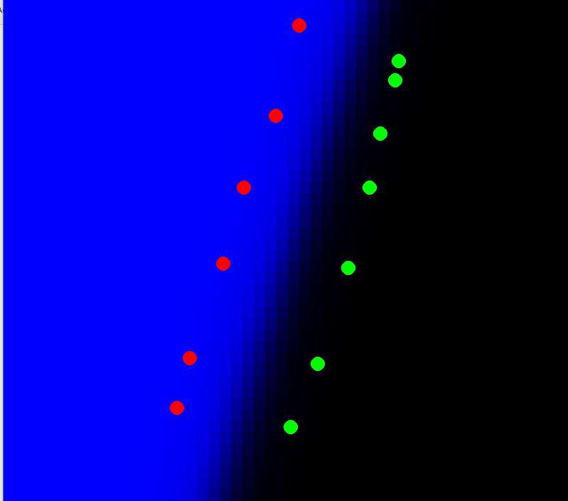
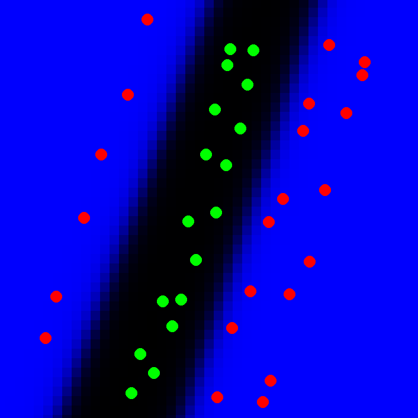

# Neural Classification

## Описание
Демонстрационное приложение для показа работы нейросети в целях класификации.

## Управление
- ПКМ - создать красную точку
- ЛКМ - создать зеленую точку
- 1 - принудительное обучение нейросети
- 2 - принудительное предсказание от нейросети

## Изображения

